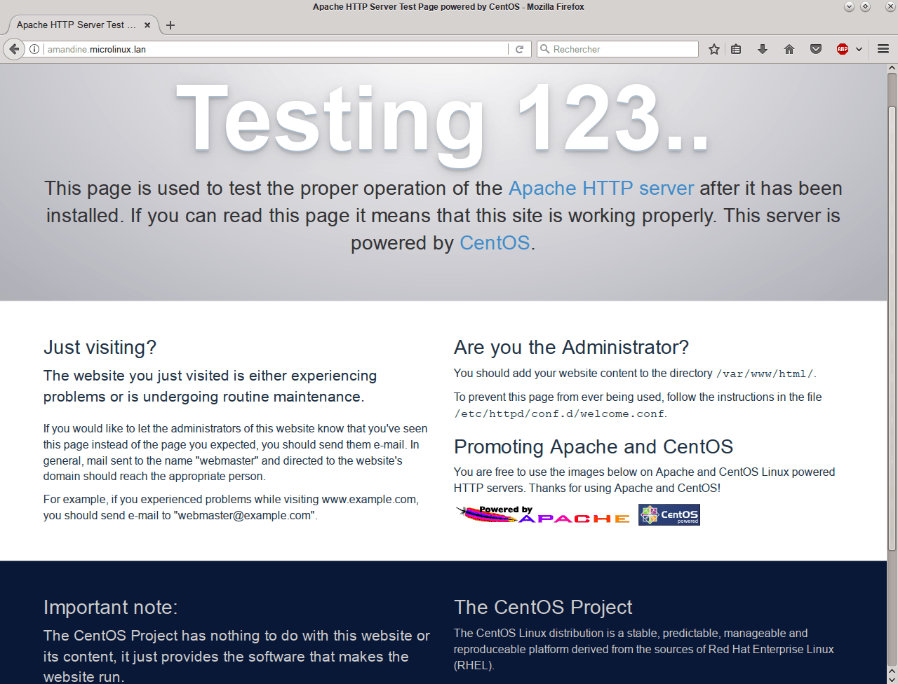
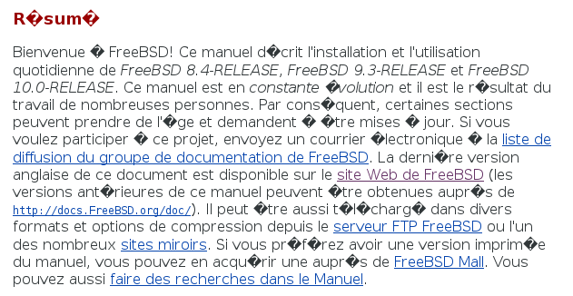
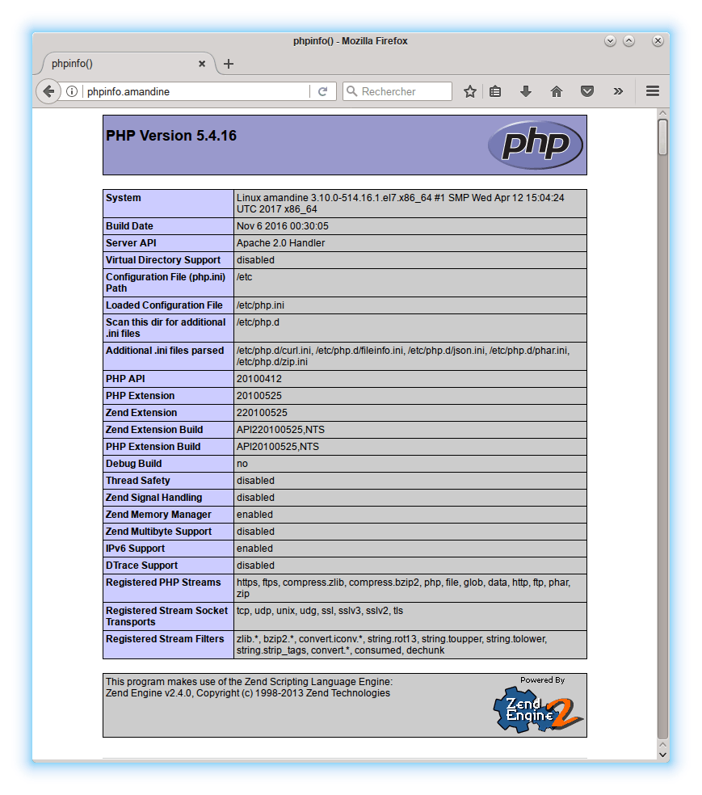

Serveur web Apache
==================

Document écrit par Nicolas Kovacs <info@microlinux.fr>

Apache est le principal serveur Web du monde de l’Open Source. D’après les
statistiques de Netcraft, plus de la moitié des sites Web du monde tournent sur
un serveur Apache.

Une installation typique d’Apache est généralement constituée d’un assemblage
cohérent de paquets.

  * le serveur Apache à proprement parler

  * des bibliothèques diverses et variées

  * des plug-ins

  * des langages de programmation

  * etc.

Cette page décrit la configuration d’un serveur Web de type LAMP (Linux +
Apache + MySQL/MariaDB + PHP) sur CentOS 7.


Prérequis
---------

Apache utilise le port 80 en TCP pour le protocole HTTP. Il faudra donc songer
à ouvrir ce port dans le pare-feu.


Installation
------------

Le serveur Apache est fourni par le paquet `httpd`.

<pre>
# <strong>yum install httpd</strong> 
</pre>

Passer SELinux en mode permissif.

<pre>
# <strong>setenforce 0</strong> 
</pre>

Activer et lancer Apache.

<pre>
# <strong>systemctl enable httpd</strong> 
# <strong>systemctl start httpd</strong> 
</pre>

Tester le bon fonctionnement du serveur.

<pre>
# <strong>links http://localhost</strong> 
</pre>

On doit voir quelque chose de ce genre.

```
=================================================================
                           Testing 123..
This page is used to test the proper operation of the Apache HTTP
server after it has been installed. If you can read this page it 
means that this site is working properly. This server is powered 
by CentOS.
=================================================================
```

Dans le réseau local, ouvrir l’adresse IP du serveur avec un navigateur.

  * `http://192.168.2.5`

On peut également invoquer le nom d’hôte.

  * `http://amandine.microlinux.lan`

Sur un serveur dédié, on essaiera successivement l’adresse IP, le nom de
domaine et l’alias associé.

  * `http://195.154.65.130`

  * `http://slackbox.fr`

  * `http://www.slackbox.fr`

Voici à quoi ressemble la page par défaut dans un navigateur graphique.

  


Configuration de base
---------------------

Le principal fichier de configuration d’Apache, c’est
`/etc/httpd/conf/httpd.conf`. Avant de modifier quoi que ce soit, on va faire une
copie du fichier de configuration par défaut.

<pre>
# <strong>cd /etc/httpd/conf</strong> 
# <strong>cp httpd.conf httpd.conf.orig</strong> 
</pre>

On peut déjà renseigner quelques directives.

<pre>
# /etc/httpd/conf/httpd.conf
...
ServerAdmin info@microlinux.fr
...
ServerName  amandine.microlinux.lan
...
</pre>

  * L’adresse mail de l’administrateur apparaîtra sur certaines pages générées
    par le serveur, notamment les pages d’erreur.

  * Le nom du serveur peut être déterminé automatiquement, mais il vaut mieux
    le spécifier explicitement.

Sur un serveur dédié, on aura ceci.

<pre>
# /etc/httpd/httpd.conf
...
ServerName sd-41893.dedibox.fr
...
</pre>

Prendre en compte les modifications.

<pre>
# <strong>systemctl reload httpd</strong> 
</pre>

Organisation des fichiers de configuration
------------------------------------------

Le fichier `/etc/httpd/conf/httpd.conf` ne contient pas l’intégralité de la
configuration d’Apache. Jetons un oeil à la dernière ligne de ce fichier.

<pre>
# Load config files in the "/etc/httpd/conf.d" directory, if any.
IncludeOptional conf.d/*.conf
</pre>

En langage tam-tam, cela signifie qu’il faut également tenir compte de tous les
fichiers `*.conf` contenus dans le répertoire `/etc/httpd/conf.d`.

<pre>
# <strong>cd /etc/httpd/conf.d/</strong> 
# <strong>ls *.conf</strong> 
autoindex.conf userdir.conf welcome.conf
</pre>


Héberger un site statique
-------------------------

Apache est immédiatement utilisable dans sa configuration par défaut. Le
serveur affiche le contenu du répertoire `/var/www/html`, défini par la
directive `DocumentRoot` dans le fichier `/etc/httpd/conf/httpd.conf`.

<pre>
DocumentRoot "/var/www/html"
</pre>

Ce répertoire est vide par défaut. En l’absence de contenu, c’est la page de
test qui s’affiche, en fonction de la configuration prédéfinie dans
`/etc/httpd/conf.d/welcome.conf`.

Pour nous épargner la corvée de créer du contenu bidon, nous pouvons très bien
récupérer un site web existant. On choisira la documentation de Slackware, qui
vient sous forme d’une série de pages HTML statiques.

<pre>
# <strong>cd /var/www/html/</strong> 
# <strong>wget -r -np -nH --cut-dirs=1 http://www.slackbook.org/html/</strong> 
</pre>

Apache n’est pas censé tourner en tant que `root`, mais en tant qu’utilisateur
spécial défini par les directives `User` et `Group` dans
`/etc/httpd/conf/httpd.conf`.

<pre>
User apache
Group apache
</pre>

On va donc attribuer toutes les pages de notre site local à cet utilisateur et
à ce groupe. En passant, on va restreindre les droits d’accès au minimum
nécessaire.

<pre>
# <strong>cd /var/www</strong> 
# <strong>chown -R apache:apache html/</strong> 
# <strong>find html/ -type d -exec chmod 0750 \{} \;</strong> 
# <strong>find html/ -type f -exec chmod 0640 \{} \;</strong> 
</pre>

À présent, on peut ouvrir le site dans un navigateur (Firefox, Links, Lynx) et
apprécier le résultat.


Apache et SELinux
-----------------

Jetons un premier coup d’oeil sur ce que pense SELinux de notre configuration.

<pre>
# <strong>sealert -a /var/log/audit/audit.log</strong> 
100% done
found 0 alerts in /var/log/audit/audit.log
</pre>

On notera que le site web statique récupéré avec `wget` a été créé d’emblée
avec le contexte de sécurité approprié `httpd_sys_content_t`. Tout va donc très
bien jusqu’ici.


Héberger plusieurs sites sur un serveur local
---------------------------------------------

Le principe des hôtes virtuels (*Virtual Hosts*) consiste à faire fonctionner
un ou plusieurs sites Web sur une même machine. L’utilisateur final ne perçoit
pas qu’en fait il s’agit d’un même serveur physique.

Sur un serveur local, on pourra essayer d’héberger trois sites.

  * `http://slackware.amandine` hébergera la documentation de Slackware.

  * `http://freebsd.amandine` affichera la documentation de FreeBSD.

  * `http://amandine` pointera vers la page par défaut du serveur.

Pour commencer, on va déplacer le site existant dans un nouveau répertoire
`slackware/html`.

<pre>
# <strong>cd /var/www/html</strong> 
# <strong>mkdir -pv ../slackware/html</strong> 
mkdir: création du répertoire « ../slackware »
mkdir: création du répertoire « ../slackware/html »
# <strong>mv * ../slackware/html/</strong> 
# <strong>mv ../slackware/ .</strong> 
</pre>

Puis, on va créer un autre répertoire `freebsd/html`, dans lequel on va
télécharger un autre site, en l’occurrence la documentation de FreeBSD.

<pre>
# <strong>mkdir -pv freebsd/html</strong> 
mkdir: création du répertoire « freebsd »
mkdir: création du répertoire « freebsd/html »
# <strong>cd freebsd/html</strong> 
# <strong>wget -r -p -np -nH --cut-dirs=4</strong> \
  <strong>http://www.freebsd.org/doc/fr_FR.ISO8859-1/books/handbook/</strong> 
</pre>

Enfin, on va mettre en place une page par défaut dans le répertoire
`default/html`. Pour ce faire, on va utiliser la page qui s’affiche lorsqu’il
n’y a pas de contenu.

<pre>
# <strong>cd /var/www/html/</strong> 
# <strong>mkdir -pv default/html</strong> 
mkdir: création du répertoire « default »
mkdir: création du répertoire « default/html »
# <strong>cp -R /usr/share/httpd/noindex/* default/html/</strong> 
</pre>

Au total, on a donc…

<pre>
# <strong>ls -l</strong> 
total 12
drwxr-xr-x 3 root root 4096 23 févr. 06:36 default
drwxr-xr-x 3 root root 4096 23 févr. 06:21 freebsd
drwxr-xr-x 3 root root 4096 23 févr. 06:19 slackware
</pre>

On va définir les permissions à la louche.

<pre>
# <strong>chown -R apache:apache *</strong> 
# <strong>find . -type d -exec chmod 0750 \{} \;</strong> 
# <strong>find . -type f -exec chmod 0640 \{} \;</strong> 
</pre>

Créer un fichier `/etc/httpd/conf.d/default.conf`. Ce fichier définira le site
affiché par défaut, c’est-à-dire lorsqu’on invoque l’adresse IP ou le nom
d’hôte de la machine.

<pre>
# /etc/httpd/conf.d/default.conf
#
# Page par défaut
&lt;VirtualHost *:80&gt;
  ServerAdmin info@microlinux.fr
  DocumentRoot "/var/www/html/default/html"
  ServerName amandine.microlinux.lan
  ServerAlias amandine
  ErrorLog logs/default-error_log
  CustomLog logs/default-access_log common
&lt;VirtualHost&gt;
</pre>

Une remarque en passant. Nous aurions pu très bien ajouter cette stance dans le
fichier `/etc/httpd/conf/httpd.conf`. La création de fichiers `*.conf`
individuels dans `/etc/httpd/conf.d` est motivée avant tout par un souci de
clarté et de lisibilité.

Prendre en compte les modifications.

<pre>
# <strong>systemctl reload httpd</strong> 
</pre>

Vérifier si la page par défaut du serveur s’affiche comme prévu.

<pre>
# <strong>links http://amandine.microlinux.lan</strong> 
</pre>

À présent, nous pouvons ajouter les deux autres sites. Le site
`http://slackware.amandine` sera configuré comme ceci.

<pre>
# /etc/httpd/conf.d/slackware.conf
#
# La documentation de Slackware
&lt;VirtualHost *:80&gt;
  ServerAdmin info@microlinux.fr
  DocumentRoot "/var/www/html/slackware/html"
  ServerName slackware.amandine.microlinux.lan
  ServerAlias slackware.amandine
  ErrorLog logs/slackware-error_log
  CustomLog logs/slackware-access_log common
&lt;VirtualHost&gt;
</pre>

La configuration de `http://freebsd.amandine` suivra la même logique.

<pre>
# /etc/httpd/conf.d/freebsd.conf
#
# La documentation de FreeBSD
&lt;VirtualHost *:80&gt;
  ServerAdmin info@microlinux.fr
  DocumentRoot "/var/www/html/freebsd/html"
  ServerName freebsd.amandine.microlinux.lan
  ServerAlias freebsd.amandine
  ErrorLog logs/freebsd-error_log
  CustomLog logs/freebsd-access_log common
&lt;VirtualHost&gt;
</pre>

Pour l’instant, les noms d’hôtes `slackware.amandine` et `freebsd.amandine` ne
correspondent à rien dans notre réseau local. Nous devons les ajouter à
`/etc/hosts` sur le serveur.

<pre>
# Amandine
192.168.2.5 amandine.microlinux.lan amandine
192.168.2.5 freebsd.amandine.microlinux.lan freebsd.amandine
192.168.2.5 slackware.amandine.microlinux.lan slackware.amandine
</pre>

Redémarrer Dnsmasq pour propager l’info DNS.

<pre>
# <strong>systemctl restart dnsmasq</strong> 
</pre>

Prendre en compte la nouvelle configuration d’Apache.

<pre>
# <strong>systemctl reload httpd</strong> 
</pre>

Tester les deux sites en local avec Links ou Firefox sur une machine du réseau
local.

  * `http://slackware.amandine.microlinux.lan`

  * `http://freebsd.amandine.microlinux.lan`


Régler les problèmes d’encodage
-------------------------------

Dans la configuration actuelle, la documentation de FreeBSD n’affiche pas
correctement les caractères accentués.

  

Ce comportement est dû à la directive `AddDefaultCharset` dans le fichier
`/etc/httpd/conf/httpd.conf`.

<pre>
AddDefaultCharset UTF-8
</pre>

Or, le code source de la page d’accueil de FreeBSD spécifie un encodage
différent.

<pre>
&lt;xml version="1.0" encoding="iso-8859-1" standalone="no"?&gt;
</pre>

Pour remédier à cela, il suffit de commenter la directive `AddDefaultCharset`,
ce qui permettra aux pages hébergées de spécifier leur propre encodage.

<pre>
<strong>#</strong>AddDefaultCharset UTF-8
</pre>

Ne pas oublier de prendre en compte la nouvelle configuration.

<pre>
# <strong>systemctl reload httpd</strong> 
</pre>

Une fois que l’on a rectifié l’encodage, Links affiche correctement la page.
Firefox est plus dur de la feuille, et il faut éventuellement rectifier
l’encodage manuellement (*Affichage > Encodage de caractères*) pour une page
présente dans le cache du navigateur.


Héberger plusieurs sites sur une machine publique
-------------------------------------------------

Sur un serveur dédié avec un ou plusieurs domaines publiquement accessibles, la
configuration de la page par défaut ressemblera à ceci.

<pre>
# /etc/httpd/conf.d/default.conf
#
# Page par défaut
&lt;VirtualHost *:80&gt;
  ServerAdmin info@microlinux.fr
  DocumentRoot "/var/www/html/default/html"
  ServerName sd-41893.dedibox.fr
  ErrorLog logs/default-error_log
  CustomLog logs/default-access_log common
&lt;VirtualHost&gt;
</pre>

La documentation de Slackware sera hébergée sur l’hôte `slackware.slackbox.fr`.

<pre>
# /etc/httpd/conf.d/slackware.conf
#
# La documentation de Slackware
&lt;VirtualHost *:80&gt;
  ServerAdmin info@microlinux.fr
  DocumentRoot "/var/www/html/slackware/html"
  ServerName slackware.slackbox.fr
  ErrorLog logs/slackware-error_log
  CustomLog logs/slackware-access_log common
&lt;VirtualHost&gt;
</pre>

Et pour l’hébergement de la documentation de FreeBSD, on suivra la même
logique.

<pre>
# /etc/httpd/conf.d/freebsd.conf
#
# La documentation de FreeBSD
&lt;VirtualHost *:80&gt;
  ServerAdmin info@microlinux.fr
  DocumentRoot "/var/www/html/freebsd/html"
  ServerName freebsd.slackbox.fr
  ErrorLog logs/freebsd-error_log
  CustomLog logs/freebsd-access_log common
&lt;VirtualHost&gt;
</pre>

Cette fois-ci, l’information sur les hôtes `slackware.slackbox.fr` et
`freebsd.slackbox.fr` devra être ajoutée dans le fichier zone de BIND, sous
forme d’alias.

<pre>
; /var/named/zone.slackbox.fr 
...
slackbox.fr.        A       195.154.65.130
ns      IN          A       195.154.65.130
mail    IN          A       195.154.65.130
www     CNAME               slackbox.fr.
ftp     CNAME               slackbox.fr.
<strong>slackware CNAME             slackbox.fr.</strong>     
<strong>freebsd   CNAME             slackbox.fr.</strong>     
</pre>

Ne pas oublier de redémarrer BIND en incrémentant le numéro de série.

<pre>
# <strong>systemctl restart named</strong> 
</pre>

Tester l’affichage des différents sites.

  * `http://slackware.slackbox.fr`

  * `http://freebsd.slackbox.fr`

  * `http://www.slackbox.fr` (page par défaut)

  * `http://sd-41893.dedibox.fr` (page par défaut)


Héberger des sites dynamiques avec PHP
--------------------------------------

Installer PHP.

<pre>
# <strong>yum install php</strong> 
</pre>

Mettre en place un hôte virtuel `http://phpinfo.amandine` et éditer la
configuration correspondante. L’hôte virtuel contiendra une seule page
`index.php` que l’on éditera comme ceci.

<pre>
&lt;?php
 echo phpinfo();
?&gt;
</pre>

Ajouter une entrée correspondante dans la configuration DNS et redémarrer
Apache.

<pre>
# <strong>systemctl restart httpd</strong> 
</pre>

Afficher la page `http://phpinfo.amandine` dans un navigateur. On doit obtenir
quelque chose qui ressemble grosso modo à ceci.

  

Le fichier `/etc/php.ini` contient la configuration de PHP. On peut commencer
par définir le fuseau horaire du serveur, nécessaire pour le bon fonctionnement
de certaines applications.

<pre>
[Date]
; Defines the default timezone used by the date functions
; http://php.net/date.timezone
<strong>date.timezone = Europe/Paris</strong>
</pre>

Redémarrer Apache et vérifier les données correspondantes dans la page qui
affiche les infos PHP.


Utiliser MySQL/MariaDB à partir de PHP
--------------------------------------

Pour utiliser MySQL/MariaDB à partir de PHP, il suffit d’installer le module
correspondant et de redémarrer Apache.

<pre>
# <strong>yum install php-mysql</strong> 
# <strong>systemctl restart httpd</strong> 
</pre>


Téléchargement
--------------

Des modèles de fichiers de configuration pour les hôtes virtuels sont
disponibles dans mon dépôt Github `centos`, dans le répertoire
`centos/el7/vhosts`.

<pre>
# git clone https://github.com/kikinovak/centos
</pre>
