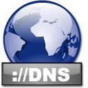
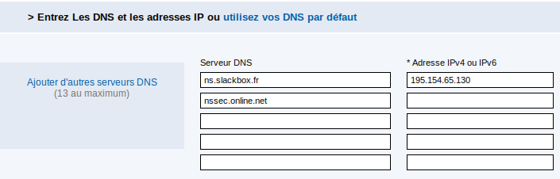
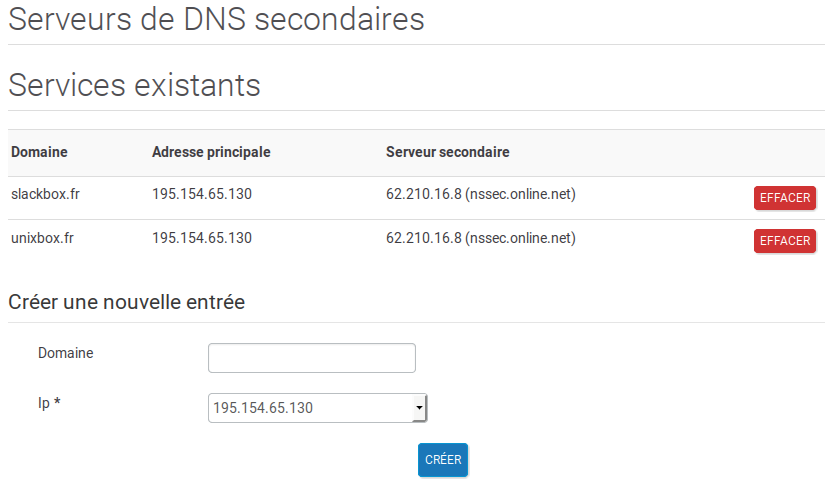
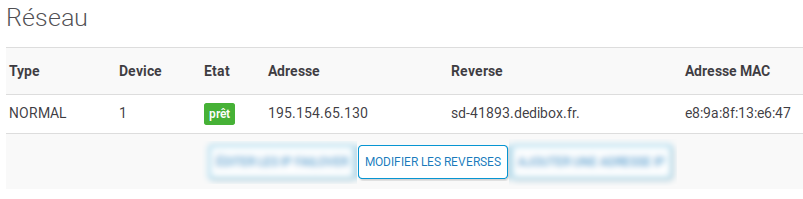

Serveur DNS avec BIND
=====================

Cette page décrit la mise en place d'un serveur DNS avec BIND sur un serveur
dédié tournant sous CentOS 7. Le système de noms de domaine ou DNS (*Domain Name
System*) permet d'établir une correspondance entre les adresses IP et les noms
de domaine. Le DNS évite ainsi d'avoir à se rappeler des adresses IP.

Prérequis
---------

Dans le pare-feu, ouvrir le port 53 en TCP et en UDP. Les gourous de la
sécurité ont longtemps conseillé d'ouvrir le port 53 en UDP seulement pour les
requêtes DNS. Or, ces dernières peuvent également utiliser le port 53 en TCP si
l'UDP n'est pas accepté.

Basculer SELinux en mode permissif.

<pre>
# <strong>setenforce 0</strong> 
</pre>

Installation
------------

Outre le serveur `bind` à proprement parler, on installera le paquet `bind-utils`,
qui fournit une collection d'outils comme `dig`, `host` et `nslookup`.

<pre>
# <strong>yum install bind bind-utils</strong> 
</pre>

Serveur cache DNS
-----------------

La configuration par défaut fournie par Red Hat est déjà assez sophistiquée. On
va la sauvegarder pour partir sur quelque chose de plus simple.

<pre>
# <strong>cd /etc</strong> 
# <strong>mv named.conf named.conf.orig</strong> 
</pre>

Éditer `/etc/named.conf` comme ceci.

<pre>
// /etc/named.conf

options {
  directory "/var/named";
};

zone "." IN {
  type hint;
  file "named.ca";
};

include "/etc/named.rfc1912.zones";
</pre>

Régler les permissions de ce fichier.

<pre>
# <strong>chown root:named /etc/named.conf</strong> 
# <strong>chmod 0640 /etc/named.conf</strong> 
</pre>

Activer et démarrer BIND.

<pre>
# <strong>systemctl enable named</strong> 
# <strong>systemctl start named</strong> 
</pre>

Exécuter `dig` sur un domaine extérieur en vérifiant le temps de requête.

<pre>
# dig centos.org @localhost
...
;; ANSWER SECTION:
centos.org.   60  IN  A 85.12.30.226
;; AUTHORITY SECTION:
centos.org.   14400 IN  NS  ns4.centos.org.
centos.org.   14400 IN  NS  ns1.centos.org.
centos.org.   14400 IN  NS  ns3.centos.org.
;; ADDITIONAL SECTION:
ns4.centos.org.   86400 IN  A 62.141.54.220
ns3.centos.org.   86400 IN  A 88.208.217.170
ns1.centos.org.   86400 IN  A 199.187.126.93
;; Query time: <strong>110 msec</strong> 
;; SERVER: 127.0.0.1#53(127.0.0.1)
;; WHEN: Mon Apr 17 11:13:02 CEST 2017
;; MSG SIZE  rcvd: 157
</pre>

Le temps de réponse devrait être bien plus court après une deuxième invocation
de `dig`.

<pre>
# <strong>dig centos.org @localhost</strong> 
...
;; Query time: <strong>5 msec</strong> 
</pre>

Configurer la journalisation
----------------------------

Dans notre configuration actuelle, les logs inondent `/var/log/messages`. Pour
éviter ça, on va configurer une journalisation propre à BIND en ajoutant la
stance correspondante à `/etc/named.conf`.

<pre>
options {
  directory "/var/named";
};

logging {
  channel single_log {
    file "/var/log/named.log" versions 3 size 2m;
    severity info;
    print-time yes;
    print-severity yes;
    print-category yes;
  };
  category default {
    single_log;
  };
};
</pre>

BIND ne peut pas créer ce fichier à la volée. On va donc le faire à sa place,
en attribuant les permissions correctes.

<pre>
# <strong>touch /var/log/named.log</strong> 
# <strong>chown named:named /var/log/named.log</strong> 
</pre>

Relancer BIND pour prendre en compte les modifications.

<pre>
# <strong>systemctl restart named</strong> 
</pre>

BIND et SELinux (1)
-------------------

On peut déjà jeter un premier coup d'oeil sur ce que pense SELinux de notre
configuration. Comme on peut s'y attendre, la définition d'un fichier journal
personnalisé nous affiche une erreur. Voyons à quoi cela ressemble.

<pre>
# <strong>sealert -a /var/log/audit/audit.log</strong> 
100% done
found 1 alerts in /var/log/audit/audit.log
------------------------------------------------------------------
SELinux is preventing /usr/sbin/named from open access on the file 
/var/log/named.log.
*****  Plugin restorecon (99.5 confidence) suggests   *****
If you want to fix the label. 
/var/log/named.log default label should be named_log_t.
Then you can run restorecon.
Do
# /sbin/restorecon -v /var/log/named.log
</pre>

Appliquons le contexte approprié comme indiqué.

<pre>
# <strong>restorecon -v /var/log/named.log</strong> 
restorecon reset /var/log/named.log context unconfined_u:object_r:
var_log_t:s0->unconfined_u:object_r:named_log_t:s0
</pre>

Effectivement, le problème est résolu.

<pre>
# echo &gt; /var/log/audit/audit.log
# systemctl restart named
# sealert -a /var/log/audit/audit.log
100% done
found 0 alerts in /var/log/audit/audit.log
</pre>

Désactiver l'IPv6
-----------------

Si l'on n'utilise pas l'IPv6, on peut désactiver le protocole en éditant
`/etc/sysconfig/named`.

<pre>
OPTIONS="-4"
</pre>

Il faudra également ajouter une option à `/etc/named.conf`.

<pre>
options {
  directory "/var/named";
  filter-aaaa-on-v4 yes; 
};
</pre>

Redémarrer BIND pour prendre en compte les modifications.

<pre>
# <strong>systemctl restart named</strong> 
</pre>

Utiliser les DNS de base de chez Online
---------------------------------------

Online met à disposition deux serveurs DNS de base que nous allons utiliser de
préférence.

<pre>
options {
  directory "/var/named";
  filter-aaaa-on-v4 yes;
  forwarders {
    62.210.16.6;
    62.210.16.7;
  };
};
</pre>

Redémarrer BIND.

<pre>
# <strong>systemctl restart named</strong> 
</pre>

Serveur maître primaire
-----------------------

À présent, nous allons configurer BIND comme serveur maître primaire du domaine
`slackbox.fr`. Le nom de domaine sera réservé au bureau d'enregistrement
(*registrar*) [BookMyName.com](https://www.bookmyname.com/).

Pour ajouter une zone DNS à BIND afin de le transformer en serveur maître
primaire, il faut tout d'abord indiquer l'emplacement du fichier de zone à
`/etc/named.conf`. Pour plus de lisibilité, nous allons créer un fichier
`/etc/named.conf.local`.

<pre>
// /etc/named.conf.local 

zone "slackbox.fr" {
  type master;
  file "zone.slackbox.fr";
};
</pre>

Le fichier `named.conf.local` aura les mêmes permissions que `named.conf`.

<pre>
# <strong>chown root:named /etc/named.conf.local</strong> 
# <strong>chmod 0640 /etc/named.conf.local</strong> 
</pre>

Éditer `/etc/named.conf` en incluant ce fichier.

<pre>
zone "." IN {
  type hint;
  file "named.ca";
};

include "/etc/named.rfc1912.zones";
<strong>include "/etc/named.conf.local";</strong>
</pre>

Le fichier `/var/named/zone.slackbox.fr` devra être édité comme ceci.

<pre>
; /var/named/zone.slackbox.fr
$TTL 86400
$ORIGIN slackbox.fr.
@ IN SOA ns.slackbox.fr. hostmaster.slackbox.fr. (
   2017041701   ; sn
        10800   ; refresh (3 heures)
          600   ; retry (10 minutes)
      1814400   ; expiry (3 semaines)
        10800 ) ; minimum (3 heures)
        IN          NS      ns.slackbox.fr.
        IN          NS      nssec.online.net.
        IN          MX      10 mail.slackbox.fr.
slackbox.fr.        A       195.154.65.130
ns      IN          A       195.154.65.130
mail    IN          A       195.154.65.130
www     CNAME               slackbox.fr.
ftp     CNAME               slackbox.fr.
</pre>

Définir les permissions qui vont bien.

<pre>
# <strong>chown root:named /var/named/zone.slackbox.fr</strong> 
# <strong>chmod 0640 /var/named/zone.slackbox.fr</strong> 
</pre>

Quelques remarques sur la syntaxe et les options utilisées.

  * La directive `$TTL` (*Time To Live*) définit le temps en secondes qu'un
    enregistrement pourra être gardé dans le cache par un autre serveur de
    noms.

  * La directive `$ORIGIN` définit le nom de domaine automatiquement ajouté à
    tous les noms de domaine incomplets (c'est-à-dire "non qualifiés") définis
    dans un enregistrement DNS. Le nom de domaine est toujours un FQDN (*Fully
    Qualified Domain Name*) et se termine en conséquence par un point`.`.

  * L'enregistrement `SOA` (*Start Of Authority*) définit les principales
    caractéristiques pour la zone ou le domaine avec un certain nombre de
    paramètres.

  * Le symbole `@` se substitue à la valeur de `$ORIGIN`, concrètement à
    `slackbox.fr`.

  * `IN` définit la classe *Internet*. D'autres valeurs existent, mais elles
    sont rarement utilisées.

  * L'enregistrement `NS` définit le serveur de noms primaire pour la zone.

  * `hostmaster.slackbox.fr` définit l'adresse mail de l'administrateur de la
    zone. L'adresse `hostmaster` est recommandée, mais n'importe quelle adresse
    mail valide peut être définie ici. Étant donné que le symbole `@` a une
    signification spécifique dans le contexte, on utilise les points comme
    séparateurs, ce qui explique la syntaxe bizarre. L'adresse mail définie ici
    est donc `hostmaster@slackbox.fr`.

  * `2017041701` définit le numéro de série associé à la zone. Par convention,
    on utilise le format `AAAAMMJJSS`. Le numéro de série doit impérativement
    être mis à jour à chaque fois que l'on modifie le domaine.

  * La valeur `refresh` contrôle la mise à jour des informations du serveur de
    noms esclave de la zone. Les valeurs typiques se situent entre 3 heures
    (`10800`) et 24 heures (`86400`).

  * La valeur `retry` définit le temps d'attente avant une deuxième tentative
    lorsque le serveur de noms esclave n'arrive pas à contacter le serveur
    maître pour rafraîchir les informations. Les valeurs typiques se situent
    entre 10 minutes (`600`) et 60 minutes (`3600`).

  * La valeur `expiry` définit le laps de temps au bout duquel les
    enregistrements de zone sont considérés comme ne faisant plus autorité. On
    choisira une valeur assez élevée, située entre une semaine (604800) à trois
    semaines (1814400).

  * La valeur `minimum` définit le laps de temps durant lequel des réponses
    négatives (`NXDOMAIN`) peuvent être gardées en cache par le serveur de noms
    esclave. Cette valeur se situera entre 0 et 3 heures (`10800`).

  * L'enregistrement `NS` (*NS Resource Record*) définit le ou les serveurs de
    noms pour le domaine ou la zone.

  * L'enregistrement `A` (*A Resource Record*) définit l'adresse IPv4 d'un hôte
    du domaine ou de la zone.

Vérifier la définition correcte de la zone.

<pre>
# <strong>named-checkzone slackbox.fr /var/named/zone.slackbox.fr</strong> 
zone slackbox.fr/IN: loaded serial 2017041701
OK
</pre>

À chaque fois que l'on modifie le fichier de zone, on doit obligatoirement
incrémenter le numéro de série. Ne pas oublier de recharger BIND après chaque
modification.

<pre>
# <strong>systemctl reload named</strong> 
</pre>

Dans l'interface de gestion de [BookMyName.com](https://www.bookmyname.com/)
(entrée de menu *Gérer*), il faudra indiquer qu'on gère nous-mêmes notre propre
DNS. Pour ce faire, cliquer sur le nom de domaine dans la liste des noms de
domaine, puis sur *Modifier* dans l'entrée de menu *Vos DNS*. Notez que dans la
deuxième ligne, l'adresse IP correspondant à `nssec.online.net` est
facultative.

  

DNS secondaire
--------------

La présence d'un serveur DNS secondaire est nécessaire pour les noms de domaine
en `.fr`. Ce n'est pas la peine de louer un deuxième serveur, Online met
gracieusement un DNS secondaire à disposition.

Dans la [console Online](https://console.online.net), afficher les données du
serveur. Dans le menu à gauche, cliquer sur *DNS secondaires* et définir une
nouvelle entrée.

  

Éditer `/etc/named.conf/local` et autoriser le transfert de la zone vers le DNS
secondaire d'Online.

<pre>
// /etc/named.conf/local 
...
zone "slackbox.fr" {
  type master;
  <strong>allow-transfer { 62.210.16.8; };</strong> 
  file "zone.slackbox.fr";
};
</pre>

Reverse DNS
-----------

Il ne reste plus qu'à configurer les *reverse DNS*. Pour une configuration
correcte du serveur, il faut que son adresse IP pointe vers le résultat de la
commande `hostname --fqdn`. En l'occurrence, nous devons faire pointer
`195.154.65.130` vers `sd-41893.dedibox.fr`. Là aussi, il faut se rendre dans
la [console Online](https://console.online.net) > *Liste de vos serveurs* >
*Serveur* > *Réseau* > *Modifier les reverses* et fournir le nom d'hôte
souhaité. Pour la prise en compte des modifications, il faudra patienter un
peu.

  

BIND et SELinux (2)
-------------------

Vérifions à nouveau si notre configuration fonctionne bien avec SELinux.

<pre>
# <strong>sealert -a /var/log/audit/audit.log</strong> 
100% done
found 0 alerts in /var/log/audit/audit.log
</pre>

On notera au passage que `named.conf.local` a été créé d'emblée avec le
contexte de sécurité `etc_t` tout comme `named.conf`.

À partir de là, on peut sereinement réactiver SELinux en mode `Strict`.

<pre>
# <strong>setenforce 1</strong> 
</pre>

Quelques vérifications
----------------------

Voici une série de commandes pour tester la configuration correcte d'un domaine.

  1. Configuration du DNS

<pre>
# <strong>host slackbox.fr</strong> 
slackbox.fr has address 195.154.65.130
slackbox.fr mail is handled by 10 mail.slackbox.fr.
</pre>

  2. Configuration du reverse DNS

<pre>
# <strong>host 195.154.65.130</strong> 
130.65.154.195.in-addr.arpa domain name pointer sd-41893.dedibox.fr.
</pre>

  3. Nom d'hôte du serveur mail

<pre>
# <strong>host -t MX slackbox.fr</strong> 
slackbox.fr mail is handled by 10 mail.slackbox.fr.
</pre>

  4. Adresse IP du serveur mail.

<pre>
# <strong>host mail.slackbox.fr</strong> 
mail.slackbox.fr has address 195.154.65.130
</pre>

Téléchargement
--------------

Des modèles de fichiers `named.conf`, `named.conf.local` et `zone.exemple.fr` sont
disponibles dans mon dépôt Github `centos`, dans le répertoire `el7/bind`.

<pre>
$ <strong>git clone https://github.com/kikinovak/centos</strong> 
</pre>

----------

Document écrit par Nicolas Kovacs &lt;info@microlinux.fr&gt;

