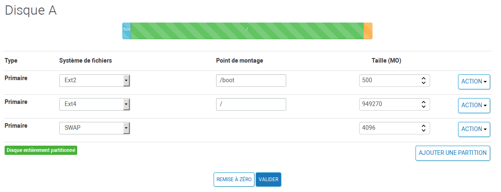
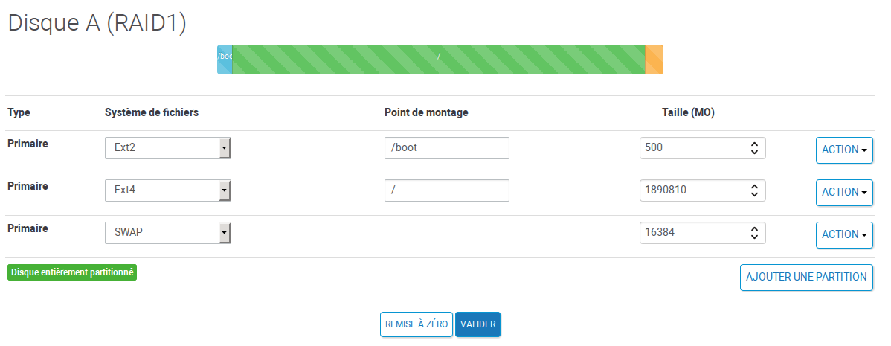

Installer un serveur dédié CentOS 7 chez Online
===============================================

Document écrit par Nicolas Kovacs <info@microlinux.fr>

Cette page décrit l'installation et la configuration de CentOS 7 sur un serveur
dédié Dedibox de chez [Online](https://www.online.net/fr). Un serveur dédié,
c'est une machine généralement située dans la salle blanche d'un datacenter. Si
vous louez un serveur dédié, une interface web correspondante vous permettra
d'installer à distance l'OS de votre choix, à condition bien sûr que celui-ci
figure dans la panoplie de systèmes proposés. Vous serez ensuite seul maître à
bord de cette machine, et vous pourrez en faire ce que vous voudrez.

  

Depuis quelques années, la société Online propose une gamme de serveurs dédiés
à des prix extrêmement intéressants, notamment la Dedibox SC, qui vous permet
de disposer d'un accès `root` sur votre propre machine à moins de dix euros par
mois.

Installation initiale de CentOS
-------------------------------

Dans un premier temps, il faut procéder au choix de la machine et du système
d'exploitation.

  1. Se connecter à la console d'Online :
  [https://console.online.net](https://console.online.net).

  2. Ouvrir le menu *Serveur* > *Liste des serveurs*.

  3. Sélectionner la machine > *Administrer* > *Installer*.

  4. *Distributions serveur* > *CentOS 7.x 64bits* > *Installer CentOS*.

Online propose un schéma de partitionnement par défaut, que nous allons modifier.

  1. Réduire la taille de la partition principale pour avoir un peu de marge.

  2. Augmenter la taille de la partition `/boot` : 500 Mo.

  3. La partition `/boot` sera formatée en `ext2`.

  4. Augmenter la taille de la partition d'échange en fonction de la RAM
     disponible.

  5. Remplir l'espace disponible pour la partition principale.

Voici ce que l'on obtient sur une Dedibox SC SATA.

  

Sur une Dedibox Start LTS, on aura quelque chose comme ceci.

  

L'écran subséquent permet de choisir le mot de passe `root`, de définir un
utilisateur "commun mortel" et de choisir un mot de passe pour cet utilisateur.

Ensuite, l'interface affiche un récapitulatif des paramètres réseau de la
machine : nom d'hôte, adresse IP, masque de sous-réseau, IP de la passerelle,
DNS primaire et secondaire. Noter ces paramètres pour les avoir sous la main.

Il ne reste plus qu'à cliquer sur *Effacer l'intégralité de mes disques durs*
pour procéder à l'installation.

Connexion initiale
------------------

L'installation du système initial dure un peu plus d'une heure. La première
connexion SSH montre qu'il y a déjà pas mal d'activité autour de notre serveur.

<pre>
Last failed login: Mon Nov 14 07:10:04 CET 2016 from 116.31.116.39
There were 87 failed login attempts since the last successful login.
</pre>

On vérifie si tous les paquets du système initial sont bien à jour.

<pre>
[root@sd-106630 ~]# <strong>yum check-update</strong> 
Loaded plugins: fastestmirror, langpacks
Loading mirror speeds from cached hostfile
 * base: centos.serverspace.co.uk
 * extras: centos.serverspace.co.uk
 * updates: mirror.econdc.com
</pre>

Apparemment, l'installateur de chez Online s'est chargé d'effectuer la mise à
jour initiale, ce qui semble logique.

Récupérer les scripts d'installation
------------------------------------

Installer Git.

<pre>
# <strong>yum install git</strong> 
</pre>

Récupérer mes scripts et mes fichiers de configuration.

<pre>
# <strong>cd</strong> 
# <strong>git clone https://github.com/kikinovak/centos</strong> 
</pre>

Le répertoire `centos/el7/install/` contient une série de scripts numérotés qui
facilitent la configuration post-installation.

Élaguer l'installation initiale
-------------------------------

La prochaine étape consiste à épurer le système installé par Online pour
revenir au strict minimum, c'est-à-dire l'équivalent de ce que l'on obtient sur
une machine locale lorsqu'on opte pour une installation minimale. Pour
faciliter cette tâche, je fournis le script `00-elaguer-paquets.sh` dans le
répertoire `centos/el7/install/`. Ce script se charge de supprimer tous les
paquets qui ne font pas partie du système de base à proprement parler. Notons
que l'opération d'élagage supprime près de 200 paquets. On passe de 490 paquets
dans la configuration d'origine à un système minimal constitué de 288 paquets
et occupant un peu plus d'un gigaoctet d'espace disque.

<pre>
# <strong>cd centos/el7/install</strong> 
# <strong>./00-elaguer-paquets.sh</strong> 
</pre>

Le script se sert de la liste de paquets `centos/el7/pkglists/minimal` qui a
été établie auparavant moyennant la commande suivante.

<pre>
# <strong>rpm -qa --queryformat '%{NAME}\n' | sort > minimal</strong> 
</pre>

Afficher la vue d'ensemble sur les groupes de paquets.

<pre>
# <strong>yum group list hidden | less</strong> 
</pre>

Il faudra rectifier à la main le statut des groupes installés.

<pre>
# <strong>yum group mark remove "Core"</strong> 
# <strong>yum group mark remove "Base"</strong> 
</pre>

Redémarrer.

<pre>
# <strong>systemctl reboot && exit</strong> 
</pre>

À l'issue du redémarrage, on réinstallera l'éditeur Vim pour un peu plus de
confort.

<pre>
# <strong>yum install vim-enhanced</strong> 
</pre>

Limiter le nombre de kernels installés
--------------------------------------

L'installation fournie par Online s'est chargée de supprimer les anciens
kernels.

<pre>
# <strong>rpm -q kernel</strong> 
kernel-3.10.0-327.36.3.el7.x86_64
</pre>

Pour éviter qu'à l'avenir, les kernels s'entassent sur le système et saturent
la partition `/boot`, on va éditer `/etc/yum.conf` pour limiter le nombre de
kernels à préserver.

<pre>
# /etc/yum.conf
...
installonly_limit=<strong>2</strong>
...
</pre>

Supprimer les services inutiles
-------------------------------

L'installation minimale comporte une poignée de services inutiles, que nous
pouvons supprimer. Notons au passage que contrairement à ce qui se dit dans des
blogs un peu partout sur le Web, NetworkManager n'est **pas** nécessaire pour
la gestion du réseau. C'est juste une couche d'abstraction et de complexité
supplémentaire, et dont on peut aisément se passer.

<pre>
# <strong>systemctl stop NetworkManager</strong> 
# <strong>yum remove NetworkManager*</strong> 
# <strong>systemctl stop postfix</strong> 
# <strong>yum remove postfix</strong> 
</pre>

Postfix sera installé plus loin en cas de besoin.

Peaufiner la configuration réseau
---------------------------------

La prochaine étape consiste à mettre un peu plus d'ordre et de clarté dans les
fichiers de configuration réseau. Le répertoire
`/etc/sysconfig/network-scripts/` contient un fichier `ifcfg-eth0` que nous
pouvons éditeur pour le rendre plus lisible.

<pre>
# /etc/sysconfig/network-scripts/ifcfg-eth0
DEVICE=eth0
TYPE=Ethernet
ONBOOT=yes
BOOTPROTO=static
IPADDR=195.154.65.130
NETMASK=255.255.255.0
</pre>

La passerelle sera définie dans `/etc/sysconfig/network`.

<pre>
# /etc/sysconfig/network
GATEWAY=195.154.65.1
</pre>

Les deux serveurs DNS seront renseignés dans `/etc/resolv.conf`.

<pre>
# /etc/resolv.conf
nameserver 62.210.16.6
nameserver 62.210.16.7
</pre>

Le fichier `/etc/hosts` ressemblera à ceci.

<pre>
# /etc/hosts
127.0.0.1      localhost.localdomain localhost
195.154.65.130 sd-41893.dedibox.fr
</pre>

Quant à `/etc/hostname`, il est censé contenir le nom d'hôte entièrement
qualifié, et c'est tout. Veillez à ne surtout pas ajouter de commentaires dans
ce fichier, sous peine de provoquer toute une série d'erreurs bizarres.

<pre>
sd-41893.dedibox.fr
</pre>

Configurer les dépôts de paquets officiels
------------------------------------------

Éditer `/etc/yum.repos.d/CentOS-Base.repo` et activer les dépôts `[base]`,
`[updates]` et `[extras]` avec une priorité maximale.

<pre>
# /etc/yum.repos.d/CentOS-Base.repo
[base]
<strong>enabled=1</strong>
<strong>priority=1</strong>
name=CentOS-$releasever - Base
...
[updates]
<strong>enabled=1</strong>
<strong>priority=1</strong>
name=CentOS-$releasever - Updates
...
[extras]
<strong>enabled=1</strong>
<strong>priority=1</strong>
name=CentOS-$releasever - Extras
...
</pre>

Laisser le dépôt `[centosplus]` désactivé.

<pre>
# /etc/yum.repos.d/CentOS-Base.repo
...
[centosplus]
<strong>enabled=0</strong>
name=CentOS-$releasever - Plus
...
</pre>

Configurer le dépôt tiers EPEL
------------------------------

Le dépôt tiers [EPEL](https://fedoraproject.org/wiki/EPEL) (*Extra Packages for
Enterprise Linux*) fournit des paquets qui ne sont pas inclus dans la
distribution CentOS. Une fois que le dépôt officiel `[extras]` est configuré,
le dépôt EPEL peut se configurer très simplement à l'aide du paquet
correspondant.

<pre>
# <strong>yum install epel-release</strong> 
</pre>

Définir les priorités du dépôt EPEL.

<pre>
# /etc/yum.repos.d/epel.repo
[epel]
enabled=1
<strong>priority=10</strong>
name=Extra Packages for Enterprise Linux 7 - $basearch
...

[epel-debuginfo]
enabled=0
name=Extra Packages for Enterprise Linux 7 - $basearch - Debug
...

[epel-source]
enabled=0
name=Extra Packages for Enterprise Linux 7 - $basearch - Source
...</pre>

Activer les priorités
---------------------

Installer le plug-in `yum-plugin-priorities`.

<pre>
# <strong>yum install yum-plugin-priorities</strong> 
</pre>

Vérifier s'il fonctionne correctement.

<pre>
# <strong>yum check-update</strong> 
Loaded plugins: fastestmirror, priorities
Loading mirror speeds from cached hostfile
 * base: mirror.plusserver.com
 * epel: mirrors.neterra.net
 * extras: centos.mirror.ate.info
 * updates: mirrors.ircam.fr
<strong>125 packages excluded due to repository priority protections</strong>
</pre>

Installer les outils de base
----------------------------

Le script `01-installer-outils.sh` installe une poignée d'outils en ligne de
commande qui ne sont pas fournis par l'installation par défaut.

<pre>
# <strong>cd /root/centos/el7/install/</strong> 
# <strong>./01-installer-outils.sh</strong> 
</pre>

Agrémenter la console
---------------------

Le script `02-configurer-base.sh` agrémente la console pour `root` et les
utilisateurs.

<pre>
# <strong>./02-configurer-base.sh</strong> 
</pre>

Outre la personnalisation du shell, le script se charge également de peaufiner
la configuration de l'éditeur Vim.

Prendre en compte la personnalisation du *shell* pour `root`.

<pre>
# <strong>source ~/.bashrc</strong> 
</pre>

Récupérer la personnalisation du *shell* pour l'utilisateur initial.

<pre>
# <strong>su - microlinux</strong> 
$ <strong>cp -v /etc/skel/.bash* .</strong> 
‘/etc/skel/.bash_logout' -> ‘./.bash_logout'
‘/etc/skel/.bash_profile' -> ‘./.bash_profile'
‘/etc/skel/.bashrc' -> ‘./.bashrc'
$ <strong>source ~/.bashrc</strong> 
$ <strong>exit</strong> 
</pre>

Activer SELinux
---------------

Dans la configuration par défaut, SELinux est désactivé.

<pre>
# <strong>getenforce</strong> 
Disabled
</pre>

Éditer `/etc/selinux/config` pour activer SELinux.

<pre>
SELINUX=<strong>permissive</strong>
SELINUXTYPE=targeted
</pre>

Le réétiquetage au prochain redémarrage est normalement déclenché par la
création d'un fichier vide `/.autorelabel`. Ce fichier existe déjà sur notre
système. 

Désactiver l'IPv6
-----------------

Créer un fichier `/etc/sysctl.d/disable-ipv6.conf` et l'éditer comme ceci.

<pre>
# /etc/sysctl.d/disable-ipv6.conf
# Disable IPv6
net.ipv6.conf.all.disable_ipv6 = 1
net.ipv6.conf.default.disable_ipv6 = 1
</pre>

La désactivation de l'IPv6 peut entraîner des problèmes avec le service SSH. Il
faut donc adapter sa configuration en conséquence.

Éditer `/etc/ssh/sshd_config` et spécifier les directives suivantes.

<pre>
# /etc/ssh/sshd_config 
...
AddressFamily inet
ListenAddress 0.0.0.0
...
</pre>

La directive `inet` désigne l'IPv4 et `inet6` l'IPv6. Les modifications seront
prises en compte au prochain redémarrage.

Installer un pare-feu personnalisé
----------------------------------

Vérifier si les paquets `iptables` et `iptables-services` sont installés.

<pre>
# <strong>rpm -qa | grep iptables</strong> 
iptables-1.4.21-13.el7.x86_64
iptables-services-1.4.21-13.el7.x86_64
</pre>

Activer le service correspondant.

<pre>
# <strong>systemctl enable iptables</strong> 
# <strong>systemctl start iptables</strong> 
</pre>

Sous CentOS, la meilleure solution consiste à éditer un simple script Bash pour
iptables, en enregistrant la configuration à la fin du script.

<pre>
# <strong>/usr/sbin/service iptables save</strong> 
</pre>

Copier le script `el7/firewall/firewall-dedibox.sh` dans un endroit approprié
et en le renommant, par exemple `/usr/local/sbin/firewall.sh`. Adapter le
script à la configuration réseau de la machine et aux services que l'on compte
héberger avant de le lancer.

<pre>
# <strong>firewall.sh</strong> 
</pre>

Afficher la configuration du pare-feu.

<pre>
# <strong>iptables -L -v -n</strong> 
</pre>

Régler les problèmes relatifs à SELinux
---------------------------------------

Afficher les alertes SELinux.

<pre>
# <strong>sealert -a /var/log/audit/audit.log</strong> 
100% done
found 2 alerts in /var/log/audit/audit.log
</pre>

J'obtiens deux alertes. Je m'occupe d'abord de celle qui me semble le plus
facilement gérable.

<pre>
SELinux is preventing audispd from open access on the file 
/etc/ld.so.cache.
*****  Plugin restorecon (94.8 confidence) suggests   ******
If you want to fix the label. 
/etc/ld.so.cache default label should be ld_so_cache_t.
Then you can run restorecon. 
Do
# /sbin/restorecon -v /etc/ld.so.cache
</pre>

Le contexte de sécurité a l'air correct.

<pre>
# <strong>ls -Z /etc/ld.so.cache</strong> 
-rw-r--r--. root root unconfined_u:object_r:ld_so_cache_t:s0 
/etc/ld.so.cache
</pre>

Je restaure le contexte par défaut comme indiqué.

<pre>
# <strong>restorecon -v /etc/ld.so.cache</strong> 
</pre>

Je vérifie si ça règle le problème.

<pre>
# <strong>echo > /var/log/audit/audit.log</strong> 
# <strong>systemctl reboot && exit</strong> 
</pre>

Après redémarrage, je relance un audit.

<pre>
# <strong>sealert -a /var/log/audit/audit.log</strong> 
100% done
found 0 alerts in /var/log/audit/audit.log
</pre>

Tout est en ordre, et je peux dorénavant passer en mode `Strict`.

<pre>
# <strong>setenforce 1</strong> 
</pre>

