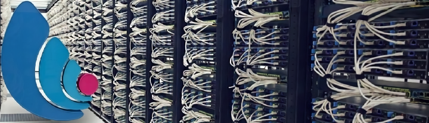

Installer un serveur dédié CentOS 7 chez Online
===============================================

Document écrit par Nicolas Kovacs <info@microlinux.fr>

Cette page décrit l’installation et la configuration de CentOS 7 sur un serveur
dédié Dedibox SC de chez [Online](https://www.online.net/fr). Un serveur dédié,
c’est une machine généralement située dans la salle blanche d’un datacenter. Si
vous louez un serveur dédié, une interface web correspondante vous permettra
d’installer à distance l’OS de votre choix, à condition bien sûr que celui-ci
figure dans la panoplie de systèmes proposés. Vous serez ensuite seul maître à
bord de cette machine, et vous pourrez en faire ce que vous voudrez.

  

Depuis quelques années, la société Online propose une gamme de serveurs dédiés
à des prix extrêmement intéressants, notamment la Dedibox SC, qui vous permet
de disposer d’un accès `root` sur votre propre machine à moins de dix euros par
mois.

Installation initiale de CentOS
-------------------------------

Dans un premier temps, il faut procéder au choix de la machine et du système
d’exploitation.

  1. Se connecter à la console d’Online :
  [https://console.online.net](https://console.online.net).

  2. Ouvrir le menu *Serveur* > *Liste des serveurs*.

  3. Sélectionner la machine > *Administrer* > *Installer*.

  4. *Distributions serveur* > *CentOS 7.x 64bits* > *Installer CentOS*.

Online propose un schéma de partitionnement par défaut, que nous allons modifier.

  1. Réduire la taille de la partition principale pour avoir un peu de marge.

  2. Augmenter la taille de la partition d’échange : 8192 Mo.

  3. La taille de la partition `/boot` est convenable : 200 Mo.

  4. La partition `/boot` sera formatée en `ext2`.

  5. Remplir l’espace disponible pour la partition principale.

Voici ce que l’on obtient.

  

L’écran subséquent permet de choisir le mot de passe `root`, de définir un
utilisateur "commun mortel" et de choisir un mot de passe pour cet utilisateur.

Ensuite, l’interface affiche un récapitulatif des paramètres réseau de la
machine : nom d’hôte, adresse IP, masque de sous-réseau, IP de la passerelle,
DNS primaire et secondaire. Noter ces paramètres pour les avoir sous la main.

Il ne reste plus qu’à cliquer sur *Effacer l’intégralité de mes disques durs*
pour procéder à l’installation.

