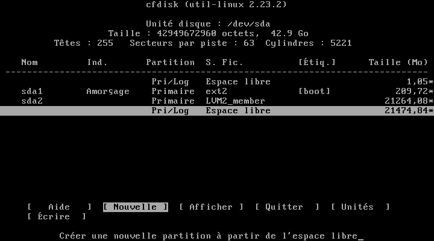
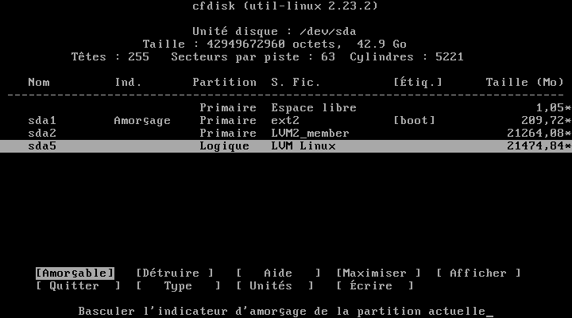

Partitionnement avec LVM sous CentOS
====================================

Document écrit par Nicolas Kovacs <info@microlinux.fr>

Un système de fichiers (FS ou *filesystem*) est installé normalement dans une
partition d’un disque dur. Il ne peut donc pas dépasser la taille de ce disque,
et il est difficile de l’étendre. LVM (*Logical Volume Manager*) ajoute une
couche d’abstraction entre le système de fichiers et les partitions du ou des
disques et permet une approche plus souple. Un FS n’est pas créé dans une
partition, mais dans un volume logique. Ce dernier peut s’étendre sur plusieurs
disques et peut être agrandi par la suite.

Concepts de base
----------------

LVM ajoute trois niveaux entre le disque dur et le système de fichiers.

  * *Physical Volumes* (PV)

  * *Volume Groups* (VG)

  * *Logical Volumes* (LV)

Voyons un peu plus en détail à quoi correspond chacun de ces niveaux.

  * *Physical Volume* (PV) – En règle générale, un PV est une partition du
    disque dur gérée par LVM. Il peut s’agir d’un disque dur entier et même
    d’un assemblage RAID. La partition, le disque dur ou l’assemblage RAID doit
    être défini en tant que PV pour que les commandes LVM puissent fonctionner.

  * *Volume Group* (VG) – Un ou plusieurs PV peuvent être assemblés en un
    groupe, ce qui permet par exemple de réunir les partitions de plusieurs
    disques durs. Un VG constitue donc un ensemble de PV, d’un point de vue
    physique.

  * *Logical Volume* (LV) – Un *Logical Volume* (LV) est une partie d’un
    *Volume Group* (VG). Pour l’utilisateur, le LV fonctionne comme une
    partition virtuelle. C’est là où il installera le système de fichiers. Ce
    dernier ne sera plus créé dans une partition comme `/dev/sda2` ou
    `/dev/sda3`, mais dans un LV comme par exemple `/dev/mapper/vg0-root` ou
    `/dev/mapper/vg0-swap`.

LVM dans la configuration par défaut de CentOS
----------------------------------------------

Pour ne pas nous embrouiller dans la théorie, on partira d’un cas pratique
relativement simple à comprendre. Lorsqu’on installe un serveur sous CentOS et
que l’on opte pour la configuration par défaut, on obtient un schéma de
partitionnement basé sur LVM. Dans l’exemple qui suit, j’ai installé CentOS
dans une machine virtuelle dotée d’un disque de 20 Go, en gardant les options
par défaut.

Jetons d’abord un oeil sur le partitionnement du disque dur.

<pre>
# <strong>fdisk -l /dev/sda</strong> 

Disque /dev/sda : 21.5 Go, 21474836480 octets, 41943040 secteurs
Unités = secteur de 1 × 512 = 512 octets
Taille de secteur (logique / physique) : 512 octets / 512 octets
taille d'E/S (minimale / optimale) : 512 octets / 512 octets
Type d'étiquette de disque : dos
Identifiant de disque : 0x000cb56b

Périphérique Amorçage  Début         Fin      Blocs    Id. Système
/dev/sda1   *        2048     2099199     1048576   83  Linux
/dev/sda2         2099200    41943039    19921920   8e  Linux LVM
</pre>

Voyons à quoi correspond la partition `/dev/sda1`.

<pre>
# <strong>mount | grep sda1</strong> 
/dev/sda1 on /boot type xfs (rw,relatime,seclabel,attr2,...)
</pre>

C’est donc ma partition `/boot`, une partition classique de type `Linux (83)`.
Elle n’est manifestement pas gérée par LVM. Le gros du système se trouve
apparemment sur la partition `/dev/sda2`, de type `Linux LVM (8e)`.

La commande `pvs` me permet d’afficher les infos sur les *Physical Volumes*
(PV) de mon système.

<pre>
# <strong>pvs</strong> 
  PV         VG           Fmt  Attr PSize  PFree
  /dev/sda2  cl_centosbox lvm2 a--  19,00g    0 
</pre>

Ici, je dispose d’un *Physical Volume* (PV) défini sur `/dev/sda2`, d’une
taille de 19 Go, et qui contient un *Volume Group* (VG) `cl_centosbox`. La
commande `vgs` me permet d’afficher les détails de ce *Volume Group*.

<pre>
# <strong>vgs</strong> 
  VG           #PV #LV #SN Attr   VSize  VFree
  cl_centosbox   1   2   0 wz--n- 19,00g    0 
</pre>

De manière similaire, j’utiliserai la commande `lvs` pour en savoir plus sur
les *Logical Volumes* (LV) définis sur la machine.

<pre>
# <strong>lvs</strong> 
  LV   VG           Attr       LSize  Pool Origin Data%  ...
  root cl_centosbox -wi-ao---- 17,00g
  swap cl_centosbox -wi-ao----  2,00g
</pre>

Dans le cas présent, j’ai deux *Logical Volumes* (LV) `root` et `swap` définis
dans le *Volume Group* (VG) `cl_centosbox`. Voici comment ils sont référencés
dans `/etc/fstab`.

<pre>
/dev/mapper/cl_centosbox-root /    xfs  defaults 0 0
/dev/mapper/cl_centosbox-swap swap swap defaults 0 0
</pre>

Exemple de partitionnement LVM personnalisé
-------------------------------------------

Dans l’exemple qui suit, on va installer CentOS 7 dans une machine virtuelle,
en optant pour un partitionnement personnalisé basé sur LVM.

  1. Cliquer sur *Destination de l’installation*.

  2. Vérifier si le ou les disques durs sont bien sélectionnés.

  3. Cocher *Je vais configurer le partitionnement* et cliquer sur *Terminé*.

  4. Dans le menu déroulant, vérifier si le schéma *LVM* est bien sélectionné.

La partition `/boot` ne sera pas gérée par LVM.

  1. Cliquer sur le bouton **+** pour créer un nouveau point de montage.

  2. Créer le point de montage `/boot` avec une capacité de 500 MiB.

  3. Conserver le *Type de périphérique Partition standard*.

  4. Choisir le système de fichiers `ext2` et l’étiquette `boot`.

  5. Confirmer *Mise à jour des paramètres*.

En revanche, la partition `swap` sera bien gérée par LVM. L’installateur
propose un *Volume Group* `cl_centosbox` par défaut, nommé en fonction du nom
d’hôte. On va remplacer ce VG par défaut par un VG personnalisé `vg0`.

  1. Cliquer sur le bouton **+** pour créer un autre point de montage.

  2. Créer le point de montage `swap` en spécifiant sa capacité en GiB.

  3. Garder le *Type de périphérique LVM*.

  4. Remplacer le *Volume Group* `cl_centosbox` par `vg0`.

  5. Choisir l’étiquette `swap`.

  6. Confirmer *Mise à jour des paramètres*.

La partition principale occupera l’espace disque restant et fera également
partie du *Volume Group* `vg0`.

  1. Cliquer sur le bouton **+** pour créer un dernier point de montage.

  2. Créer le point de montage `/` sans spécifier la capacité souhaitée.

  3. Garder le *Type de périphérique LVM*.

  4. Garder le *Volume Group* `vg0`.

  5. Choisir le système de fichiers `ext4` et l’étiquette `root`.

  6. Confirmer *Mise à jour des paramètres*, puis *Terminé*.

Voyons ce que donne notre installation personnalisée après le redémarrage
initial. Pour le disque dur, la seule chose qui a changé, c’est la taille de la
partition `/boot` sur `/dev/sda1`.

<pre>
# <strong>fdisk -l /dev/sda</strong> 
...
Périphérique Amorçage  Début         Fin      Blocs    Id. Système
/dev/sda1   *        2048      411647      204800   83  Linux
/dev/sda2          411648    41943039    20765696   8e  Linux LVM
</pre>

Nous disposons d’un *Physical Volume* (PV) sur `/dev/sda`, avec un *Volume
Group* `vg0`.

<pre>
# <strong>pvs</strong> 
  PV         VG  Fmt  Attr PSize  PFree
  /dev/sda2  vg0 lvm2 a--  19,80g    0 
</pre>

Ce *Volume Group* occupe toute la taille de la partition.

<pre>
# <strong>vgs</strong> 
  VG  #PV #LV #SN Attr   VSize  VFree
  vg0   1   2   0 wz--n- 19,80g    0 
</pre>

Il contient deux *Logical Volumes* `root` et `swap`.

<pre>
# <strong>lvs</strong> 
  LV   VG  Attr       LSize  Pool Origin Data%  ...
  root vg0 -wi-ao---- 17,80g
  swap vg0 -wi-ao----  2,00g 
</pre>

Dans `/etc/fstab`, ces *Logical Volumes* (LV) sont référencés comme ceci.

<pre>
/dev/mapper/vg0-root    /    ext4  defaults  1 1
/dev/mapper/vg0-swap    swap swap  defaults  0 0
</pre>

Redimensionnement à chaud de la partition principale
----------------------------------------------------

Prenons un cas concret tel qu’il peut se présenter dans le quotidien d’un
admin. Votre serveur est installé dans une machine virtuelle, et vous souhaitez
agrandir la taille du disque. Dans notre installation sous VirtualBox, nous
pourrons redimensionner le disque virtuel comme ceci (**TODO**). Au prochain
démarrage du serveur, le disque disposera d’une certaine quantité d’espace
libre, comme nous pouvons le voir avec `cfdisk`.

  

Dans cet espace libre, je crée une partition logique `/dev/sda5` de type `Linux
LVM (8e)`.

  

Ma nouvelle partition n’apparaît pas encore. Je peux utiliser la commande
`partprobe` pour informer le système d’exploitation de la modification de la
table de partitions.

<pre>
# <strong>partprobe</strong> 
</pre>

Voilà comment se présente mon disque dur.

<pre>
# <strong>fdisk -l</strong> 
...
Périphérique Amorçage  Début         Fin      Blocs    Id. Système
/dev/sda1   *        2048      411647      204800   83  Linux
/dev/sda2          411648    41943039    20765696   8e  Linux LVM
/dev/sda3        41943040    83886079    20971520    5  Extended
/dev/sda5        41943103    83886079    20971488+  8e  Linux LVM
</pre>

Je crée un nouveau *Physical Volume* (PV) dans ma nouvelle partition.

<pre>
# <strong>pvcreate /dev/sda5</strong> 
  Physical volume "/dev/sda5" successfully created.
</pre>

J’affiche l’état de mes *Physical Volumes* (PV).

<pre>
# <strong>pvs</strong> 
  PV         VG  Fmt  Attr PSize  PFree 
  /dev/sda2  vg0 lvm2 a--  19,80g     0 
  /dev/sda5      lvm2 ---  20,00g 20,00g
</pre>

J’étends mon *Volume Group* `vg0` pour qu’il englobe également le *Physical
Volume* (PV) `/dev/sda5`.

<pre>
# <strong>vgextend vg0 /dev/sda5</strong> 
  Volume group "vg0" successfully extended
</pre>

Mon *Volume Group* `vg0` est désormais bien réparti sur les deux *Physical
Volumes*.

<pre>
# <strong>pvs</strong> 
  PV         VG  Fmt  Attr PSize  PFree 
  /dev/sda2  vg0 lvm2 a--  19,80g     0 
  /dev/sda5  vg0 lvm2 a--  20,00g 20,00
</pre>

Mon *Logical Volume* `root` n’occupe actuellement que près de la moitié de
l’espace disque disponible.

<pre>
# <strong>lvs</strong> 
  LV   VG  Attr       LSize  Pool Origin Data%  ...
  root vg0 -wi-ao---- 17,80g
  swap vg0 -wi-ao----  2,00g
</pre>

Je peux étendre sa taille de manière à ce qu’il occupe le restant de l’espace disponible.

<pre>
# <strong>lvextend -l +100%FREE /dev/mapper/vg0-root</strong> 
  Size of logical volume vg0/root changed 
  from 17,80 GiB (4557 extents) 
  to 37,80 GiB (9676 extents).
  Logical volume vg0/root successfully resized.
</pre>

Voyons le résultat.

<pre>
# <strong>lvs</strong> 
  LV   VG  Attr       LSize  Pool Origin Data%  ...
  root vg0 -wi-ao---- 37,80g
  swap vg0 -wi-ao----  2,00g
</pre>

Ma partition principale utilise un système de fichiers `ext4`. Je peux
redimensionner ce système de fichiers en utilisant la commande suivante.

<pre>
# <strong>resize2fs /dev/mapper/vg0-root</strong> 
resize2fs 1.42.9 (28-Dec-2013)
Le système de fichiers de /dev/mapper/vg0-root est monté sur / ; 
le changement de taille doit être effectué en ligne
old_desc_blocks = 3, new_desc_blocks = 5
Le système de fichiers /dev/mapper/vg0-root a maintenant une taille 
de 9908224 blocs.
</pre>

L’opération a bien fonctionné, et j’ai doublé l’espace disque disponible pour
mon système.

<pre>
# <strong>df -h</strong> 
Sys. de fichiers     Taille Utilisé Dispo Uti% Monté sur
/dev/mapper/vg0-root    38G    968M   35G   3% /
...
</pre>

